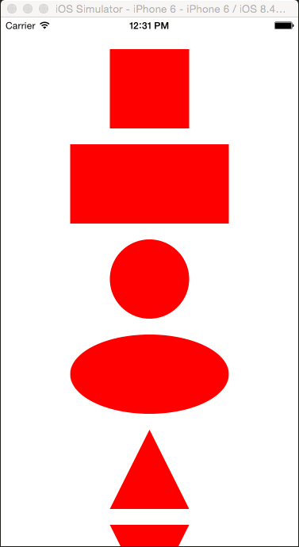

# React Native Shape

Custom shapes for React Native apps

This library is truly an inspiration from [The shape of CSS](https://css-tricks.com/the-shapes-of-css/) and the example assets for demonstrating this library are been used from an article on [CodeDaily](https://codedaily.io/tutorials/22/The-Shapes-of-React-Native).

Currently, this library is supporting 9 basic shapes mentioned below.
```bash
Square, Rectangle, Circle, Oval, Triangle, Trapezoid, Pentagon, Hexagon & Octagon.
```

## Demo



## Installation

```bash
npm install react-native-shape
```

## Properties

| Name          | Type    | Default      |
|---------------|---------|--------------|
| **color**     | String  | #1e90ff      |
| **rotate**    | Int     | 0 (in deg)   |
| **scale**     | Float   | 1            |

## Example Usage

```js
import React from 'react';
import { View } from 'react-native';
import { Circle, Triangle } from 'react-native-shape';

export default class App extends React.Component {
  render() {
    return (
      <View>
        <Circle />
        <Triangle color="red" scale={1.2} rotate={45} />
      </View>
    );
  }
}
```

## Contributing
Contributions are very welcome for bug fixes & new features

## License

MIT
